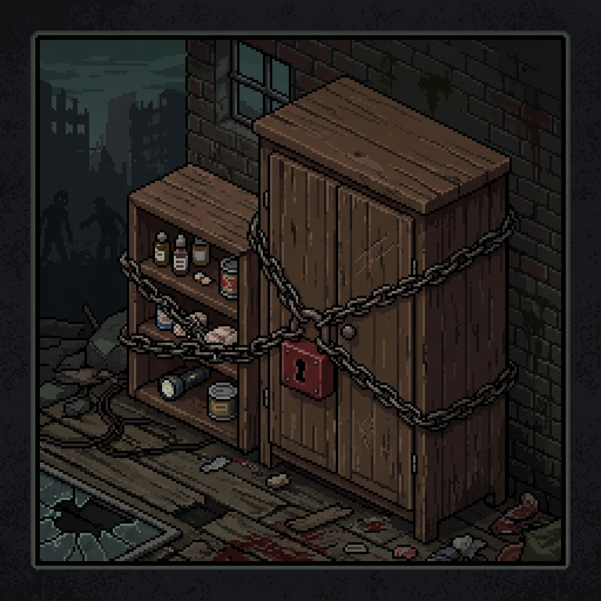

<div align="center">



# 🧟 Protected Armories & Loot Respawn

**Protección absoluta e indestructible para armerías, comisarías, tiendas de armas y bases militares en Project Zomboid.**

[](https://projectzomboid.com/)
[](https://steamcommunity.com/sharedfiles/filedetails/?id=3788795717)
[](LICENSE)
[]()

</div>

---

## 📖 Acerca del Mod

**Protected Armories & Loot Respawn** es un mod avanzado para **Project Zomboid (Build 42.x & Build 41.x)** diseñado para servidores multijugador y partidas en solitario. Identifica y protege automáticamente todos los contenedores de armas y armaduras en comisarías, tiendas de armas, puestos militares y prisiones de Knox Country.

> [!IMPORTANT]
> **Protección Absoluta Sin Excepciones:** Los contenedores protegidos son **100% inamovibles e indestructibles** por métodos tradicionales para **TODOS** los jugadores (incluyendo usuarios con rol de Administrador o Moderador).

---

## ⚡ Características Destacadas

* 🔒 **Bloqueo Inamovible:** Anula la herramienta de mover/levantar muebles (`Pick Up`).
* 🔨 **Bloqueo Indestructible:** Anula las opciones de desguazar/desmontar (`Disassemble` / `Scrap`) y la destrucción con mazo (*Sledgehammer*).
* 🔄 **Reaparición Automática de Loot (*Loot Respawn*):** Realiza un *snapshot* del contenido inicial del contenedor (armas, accesorios, municiones) y lo regenera automáticamente cada ciclo configurable (por defecto **24 horas de juego**).
* ℹ️ **Menú Contextual Informativo:** Clic derecho sobre un contenedor muestra un submenú limpio con el estado y la ubicación de la armería.
* 🎯 **Detección Dinámica Universal:** Funciona automáticamente en mapas nativos (Rosewood, Muldraugh, West Point, Riverside, Louisville, etc.) y en mapas de mods personalizados.

---

## 🛡️ Contenedores y Habitaciones Protegidas

### 1. Sprites Específicos de Armería (Protegidos en todo el mapa)
| Sprite ID | Tipo de Contenedor | Descripción |
| :--- | :--- | :--- |
| `furniture_storage_02_8` | Armario metálico doble | Armario de armas con rejilla frontal |
| `furniture_storage_02_9` | Armario metálico doble | Armario de armas (orientación E/O) |
| `furniture_storage_02_10` | Armario metálico individual | Armario individual de armas |
| `furniture_storage_02_11` | Armario metálico individual | Armario individual de armas |
| `furniture_storage_02_4` .. `furniture_storage_02_7` | Armarios blindados | Armarios metálicos de equipamiento / armadura |

### 2. Habitaciones Protegidas (`RoomDef`)
* **Comisarías de Policía:** `policestorage`, `policegunstorage`, `policelocker`, `policeswat`, `policeoutfitstorage`, `policearchive`, `policeoffice`, `policeevidence`, `policehall`, `police`
* **Tiendas de Armas:** `gunstore`, `gunstorestorage`, `gunstoredisplay`
* **Bases & Tiendas Militares:** `armystorage`, `armysurplus`, `armytent`, `armymedical`, `army`
* **Prisiones & Seguridad:** `prisonstorage`, `prisonarmory`, `prisoncell`, `prison`, `security`, `securitystorage`

---

## ⚙️ Opciones de Sandbox (Sandbox Vars)

Puedes personalizar el comportamiento del mod directamente desde las opciones de Sandbox:

| Variable | Defecto | Descripción |
| :--- | :---: | :--- |
| `ProtectPolice` | `true` | Proteger comisarías de policía y taquillas armeras. |
| `ProtectGunStores` | `true` | Proteger tiendas de armas y sus almacenes. |
| `ProtectMilitary` | `true` | Proteger bases militares, armerías y tiendas surplus. |
| `ProtectPrisons` | `true` | Proteger armerías y taquillas de prisiones. |
| `PreventMoving` | `true` | Bloquear mover o levantar muebles. |
| `PreventDisassembling` | `true` | Bloquear desguazar o desmontar. |
| `PreventSledgehammer` | `true` | Bloquear destrucción con mazo. |
| `EnableLootRespawn` | `true` | Activar reaparición periódica del loot inicial. |
| `RespawnIntervalHours` | `24` | Intervalo en horas de juego para el respawn del loot. |

---

## 📍 Lista de Ubicaciones y Comandos de Teletransporte

Puedes usar estos comandos directamente en el chat (`/teleportto X,Y,Z`) o en la consola Lua (`getPlayer():setX(X); getPlayer():setY(Y); getPlayer():setZ(Z)`):

### 🚓 Comisarías de Policía
| Ubicación | Zona | Coordenadas `(X, Y, Z)` | Comando de Teletransporte |
| :--- | :--- | :---: | :--- |
| **Rosewood Police Station** | `policegunstorage` | `8067, 11722, 0` | `/teleportto 8067,11722,0` |
| **Muldraugh Police Station** | `policegunstorage` | `10635, 10410, 0` | `/teleportto 10635,10410,0` |
| **West Point Police Station** | `policegunstorage` | `11900, 6960, 0` | `/teleportto 11900,6960,0` |
| **Riverside Police Station** | `policegunstorage` | `6080, 5265, 0` | `/teleportto 6080,5265,0` |
| **Louisville Central Police HQ** | `policegunstorage` | `12480, 3600, 0` | `/teleportto 12480,3600,0` |
| **Louisville SWAT HQ / Armory** | `policeswat` | `12350, 3520, 0` | `/teleportto 12350,3520,0` |

### 🔫 Tiendas de Armas (*Gun Stores*)
| Ubicación | Zona | Coordenadas `(X, Y, Z)` | Comando de Teletransporte |
| :--- | :--- | :---: | :--- |
| **West Point Gun Store** | `gunstorestorage` | `12065, 6765, 0` | `/teleportto 12065,6765,0` |
| **Doe Valley Gun Store** | `gunstore` | `3790, 8520, 0` | `/teleportto 3790,8520,0` |
| **Louisville East Gun Store** | `gunstorestorage` | `13240, 3340, 0` | `/teleportto 13240,3340,0` |
| **Louisville West Gun Store** | `gunstorestorage` | `12110, 1530, 0` | `/teleportto 12110,1530,0` |

### 🎖️ Bases y Tiendas Militares (*Army & Surplus*)
| Ubicación | Zona | Coordenadas `(X, Y, Z)` | Comando de Teletransporte |
| :--- | :--- | :---: | :--- |
| **Dixie Highway Army Surplus** | `armysurplus` | `11580, 8820, 0` | `/teleportto 11580,8820,0` |
| **Valley Station Surplus Store** | `armysurplus` | `12905, 5120, 0` | `/teleportto 12905,5120,0` |
| **Louisville Checkpoint Storage** | `armystorage` | `12550, 4300, 0` | `/teleportto 12550,4300,0` |
| **Secret Military Base (Forest)** | `armystorage` | `5570, 12480, 0` | `/teleportto 5570,12480,0` |

### 🔒 Prisiones y Seguridad
| Ubicación | Zona | Coordenadas `(X, Y, Z)` | Comando de Teletransporte |
| :--- | :--- | :---: | :--- |
| **Rosewood Prison Armory** | `prisonarmory` | `7660, 11825, 0` | `/teleportto 7660,11825,0` |
| **March Ridge Security Office** | `securitystorage` | `10100, 12720, 0` | `/teleportto 10100,12720,0` |
| **Louisville Pawn Shop** | `securitystorage` | `12810, 3620, 0` | `/teleportto 12810,3620,0` |

---

## 🛠️ Developer Toolkit (`dev.py`)

El repositorio incluye un conjunto de herramientas CLI automáticas en Python para garantizar la calidad del código:

```bash
# Ejecutar pipeline completo (Linter + Test Suite + Sync automático)
python dev.py all

# Análisis estático y verificación de sintaxis Lua
python dev.py lint

# Ejecutar suite de pruebas unitarias (18 tests)
python dev.py test

# Desplegar automáticamente a la carpeta de mods del juego y Workshop
python dev.py sync

# Modo observador (Watcher): Re-analiza y re-despliega automáticamente al guardar
python dev.py watch
```

---

## 📜 Licencia
Este proyecto está bajo la Licencia MIT. Creado por **Sergio**.
